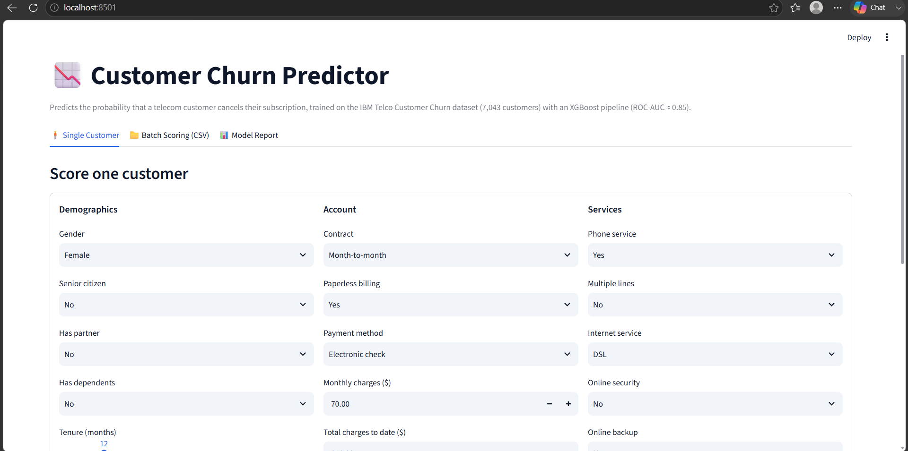
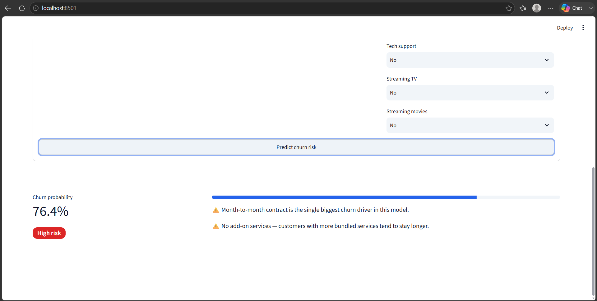
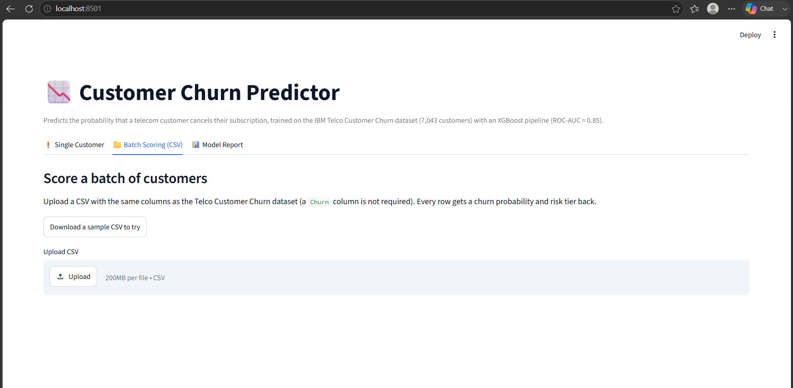
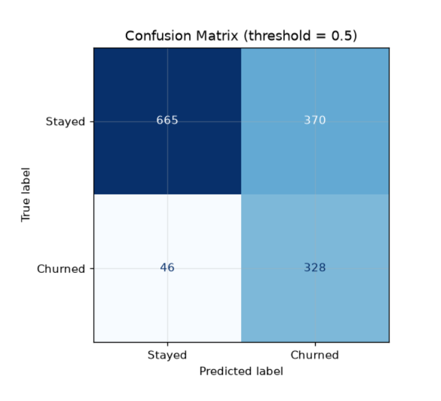
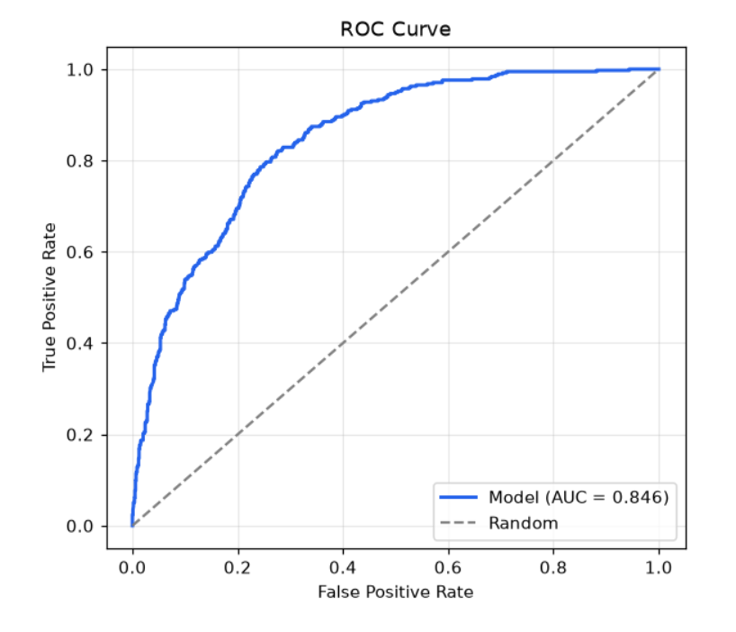
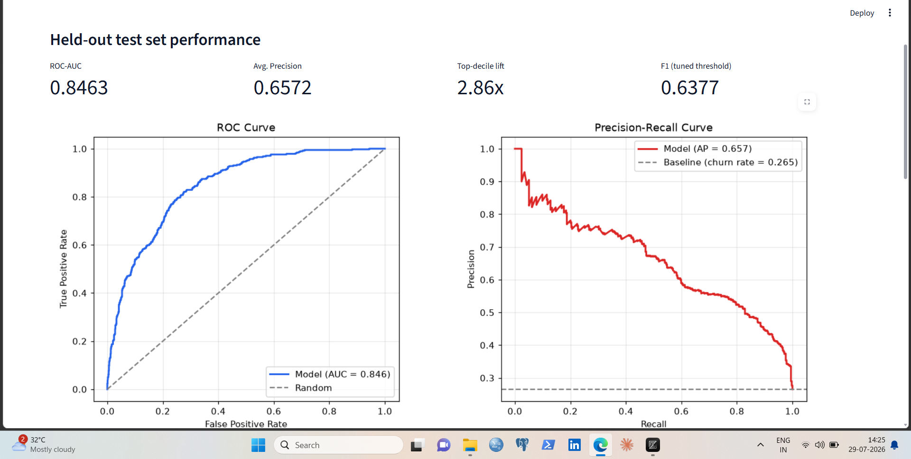

# Customer Churn Prediction & Retention Scoring App

An end-to-end machine learning product that predicts which telecom customers
are about to cancel their subscription — from raw data to a deployed,
interactive web app a retention team could actually use.

**Live components:**
- A trained XGBoost model (ROC-AUC 0.85, selected against Logistic
  Regression and Random Forest via cross-validated search)
- A full evaluation report: precision-recall curve, ROC curve, lift /
  cumulative gains chart, confusion matrix, feature importance
- A Streamlit app for single-customer lookup and batch CSV scoring
- A Flask REST API for programmatic scoring (e.g. from a CRM webhook)

---

## 1. The business problem

Acquiring a new customer costs far more than retaining an existing one. If a
retention team can identify *which* customers are likely to churn *before*
they leave, they can proactively intervene (discount, outreach call, plan
change) on a much smaller, targeted list instead of guessing.

This project frames churn as a **binary classification** problem and,
critically, doesn't stop at a model — it turns the model's output into a
**ranked, actionable customer list**, which is what actually gets used in a
retention workflow.

## 2. Dataset

[IBM Telco Customer Churn dataset](https://www.kaggle.com/datasets/blastchar/telco-customer-churn)
— 7,043 residential telecom customers, 21 raw columns, ~26.5% churn rate
(realistically imbalanced, not artificially balanced). Columns cover
demographics, account/contract info, and which add-on services each
customer subscribes to.

The raw CSV is included at `data/telco_churn.csv` so the project runs
out of the box with no external download step.

## 3. Project structure

```
churn-project/
├── data/
│   └── telco_churn.csv          # raw dataset
├── src/
│   ├── feature_engineering.py   # cleaning + engineered features
│   ├── train.py                 # preprocessing pipeline, CV, hyperparameter search
│   └── evaluate.py              # metrics, PR/ROC/lift charts, feature importance
├── models/                       # created after training
│   ├── churn_pipeline.pkl        # full sklearn Pipeline (preprocess + model)
│   ├── holdout_test_set.csv      # untouched 20% test split
│   └── training_summary.json
├── reports/                       # created after evaluation
│   ├── classification_report.txt
│   ├── confusion_matrix.png
│   ├── roc_curve.png
│   ├── precision_recall_curve.png
│   ├── lift_chart.png
│   ├── feature_importance.png
│   └── metrics_summary.json
├── app.py                # Streamlit app (main product)
├── api.py                # Flask REST API (bonus)
├── run_pipeline.py       # one command: train + evaluate
├── requirements.txt
└── README.md
```

## 4. Feature engineering

The raw columns alone are enough for a mediocre model. These engineered
features are what push it from "fine" to actually useful, and are the part
of this project worth talking about in an interview:

| Feature | Why it helps |
|---|---|
| `tenure_group` | Churn risk drops off very non-linearly with tenure; binning captures the "danger zone" in the first 6-12 months explicitly. |
| `avg_monthly_spend` | `TotalCharges / tenure` — catches customers whose realized spend differs from their current listed plan price. |
| `num_add_on_services` | Count of subscribed add-ons (security, backup, streaming, etc.). More bundled services = stickier customer. |
| `is_month_to_month` | Explicit flag for the single strongest churn driver in this dataset — no cancellation penalty. |
| `risky_payment_profile` | Paperless billing + electronic check — a known higher-churn combination (lower friction to leave). |
| `senior_living_alone` | Senior citizen with no partner/dependents — a higher-risk demographic combination. |
| `clv_proxy` | `tenure × MonthlyCharges` — a simple customer lifetime value estimate. |
| `charge_per_service` | Is this customer paying a premium relative to what they actually use? |

All cleaning/encoding/scaling lives inside a single scikit-learn
`ColumnTransformer` + `Pipeline`, so the *exact* transformation used in
training is reused at inference time in the app — no train/serve skew, and
no manually re-implementing preprocessing logic in `app.py`.

## 5. Modeling approach

- **Train/test split:** stratified 80/20, so churn rate is preserved in
  both sets.
- **Class imbalance:** handled with SMOTE, applied *inside* the
  cross-validation pipeline (via `imblearn.pipeline.Pipeline`) so
  oversampling only ever touches the training fold, never the validation
  fold — a common leakage mistake this avoids.
- **Models compared:** Logistic Regression (interpretable baseline),
  Random Forest, XGBoost.
- **Hyperparameter tuning:** `RandomizedSearchCV` with stratified k-fold CV,
  optimizing ROC-AUC (more informative than accuracy on an imbalanced
  target).
- **Model selection:** best cross-validated ROC-AUC wins, then refit on the
  full training set and scored once on the untouched test set.
- **Threshold tuning:** in addition to the default 0.5 cutoff, the
  evaluation script finds the probability threshold that maximizes F1 —
  worth mentioning that "0.5 is not always the right cutoff" for imbalanced
  problems.

## 6. Results (on the held-out test set)

| Metric | Value |
|---|---|
| ROC-AUC | **0.846** |
| Average precision (PR-AUC) | 0.661 |
| Precision / Recall / F1 @ 0.5 | 0.56 / 0.70 / 0.63 |
| Precision / Recall / F1 @ tuned threshold (0.47) | 0.56 / 0.75 / 0.64 |
| **Top-decile lift** | **2.89x** over random targeting |
| Churners captured in top 2 deciles | **~51%** of all churners, by contacting only 20% of customers |

The lift/gains numbers are the ones that matter most for the business
framing: **contacting the riskiest 20% of customers catches about half of
everyone who was actually going to churn** — a retention team's outreach
budget goes roughly 2.9x further than if they called customers at random.

Full charts are generated in `reports/` — see `lift_chart.png` and
`precision_recall_curve.png` in particular; those (not a bare accuracy
number) are what to screenshot for a portfolio write-up.

---

# Dashboard Preview

## Main Dashboard



---

## Single Customer Prediction



---

## Batch Prediction



---

## Confusion Matrix



---

## ROC Curve



---

## Classification Report



## 7. Setup & how to run

```bash
# 1. Clone / unzip the project, then create a virtual environment
cd churn-project
python3 -m venv venv
source venv/bin/activate        # Windows: venv\Scripts\activate

# 2. Install dependencies
pip install -r requirements.txt

# 3. Train + evaluate (takes about 1-2 minutes)
python run_pipeline.py
# equivalent to running:
#   python src/train.py
#   python src/evaluate.py

# 4. Launch the app
streamlit run app.py
# open http://localhost:8501

# 5. (Optional) run the REST API instead / as well
python api.py
# curl -X POST http://localhost:5000/predict -H "Content-Type: application/json" -d '{...}'
```

`models/` and `reports/` are generated by step 3 — they're not pre-shipped,
so the first thing anyone cloning this repo sees is the pipeline actually
running, not stale output.
